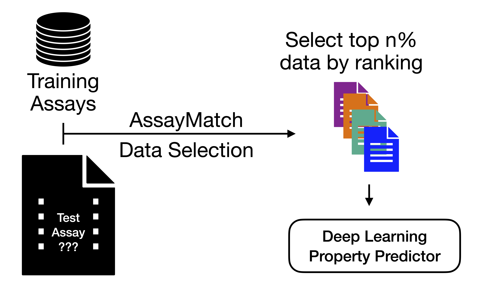

# AssayMatch
This repository contains code for AssayMatch: Learning to Select Data for Molecular Activity Models


## Installation
```
#create a new environment
conda create -n AssayMatch python=3.11
conda activate AssayMatch
python -m pip install -r requirements.txt
```

## Code Description
```
AssayMatch/
├── assaymatch/
│   ├── step1_prepare_trak.py #Compute TRAK scores and aggregate
│   ├── step2_prepare_finetune.py #Finetune embeddings with TRAK derived signal
│   └── step3_generate_data.py #Greedily select datasets with TRAK scores
├── scripts/
│   ├── dispatcher_multi.py #AssayMatch generates config files that are run other scripts through this dispatcher
│   └── #... other scripts
├── benchmark/
│   └── run1/ #benchmarking runs go here
├── smiles-transformer/ (adapted from Shion Honda, 2019 under the MIT License)
├── README.md
├── requirements.txt
└── benchmark.sh #run this to do a new benchmarking trial
```

## Replication Instructions

To replicate our expeirmental results, we make our benchmarking datasets and intermediate finetuning checkpoints + TRAK scores avaailble at [zenodo](https://doi.org/10.5281/zenodo.17656531). 

To compute rankings for all ChEMBL IC50 data, use `scripts/make_dataset.py` and run TRAK for the appropriate model. Save the dataset for each chembl_id to `data/{chembl_id}/total.csv` and the TRAK scores to the same directory. Then use `scripts/get_true_rankings.py` to get the assays ranked by Per Assay TRAK score for embedding finetuning.  

This project includes code adapted from SmilesTransformer (Shion Honda, 2019), used under the MIT License.
